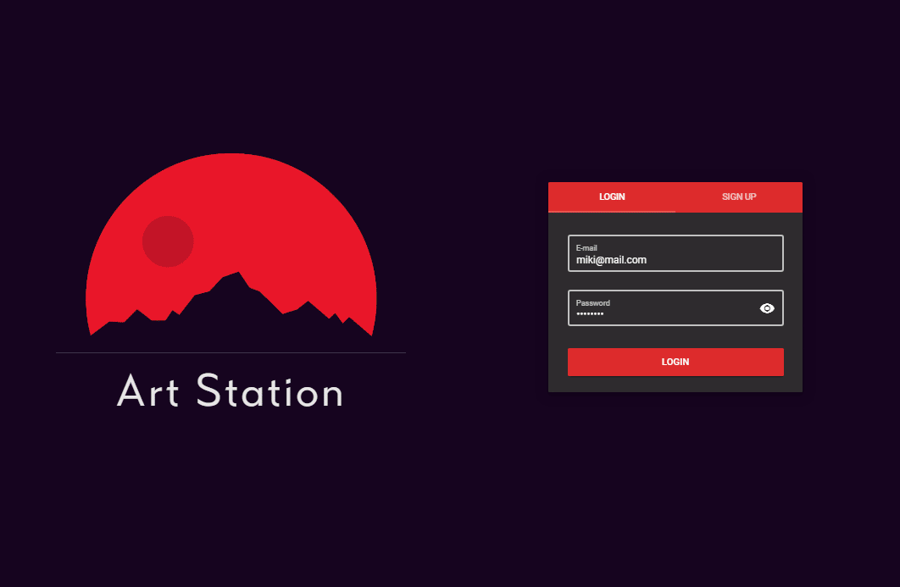

# Art Station
Art Station is an online platform for creating and sharing artistic sketches directly in browser. 

## Features
- Sketch system with different brushes and colors
- Wall with all created sketches
- Favourites list
- Like/Dislike system
- Profile page with basic info and user sketches



## Requirements
#### Back End
- redis-cli
- Node.js
- npm

#### Front End
- Node.js
- npm

## Project Setup
#### Back End
To serve the API locally, start the Redis server by running:
```console
sudo service redis-server restart
```

Then, install all required dependencies by running the following command in the **/back** directory:
```console
npm install
```

Finally, in the same directory, start the Node.js server with:
```console
node server.js
```

#### Front End
To serve the front-end part of the application, first install all required dependencies by running the following command in the **/front** directory:
```console
npm install
```

Then, in the same directory, start the application by running:
```console
npm run serve
```

## Initialize Database *(optional)*
To initialize redis database with several accounts and sketches, execute the following command in the **/back** directory:
```console
node init.js
```
